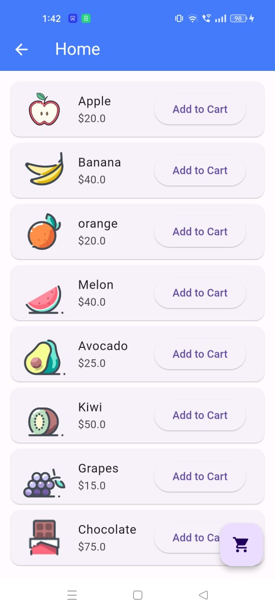

# Flutter Shopping Cart Application

This is a Flutter application that allows users to browse products, add them to a shopping cart, and view their order summary.

## Features

- **User authentication**: Users can create an account or log in to their existing account.
- **Product browsing**: Users can view a list of products on the home page.
- **Adding to cart**: Users can add products to their shopping cart.
- **Order summary**: Users can view their selected products and the total bill in the cart page.


## App Snapshots

<table>
  <tr>
    <td>Login Screen</td>
     <td>Login Alert</td>
     <td>Home Screen</td>
  </tr>
  <tr>
    <td></td>
    <td></td>
    <td></td>
  </tr>

   <tr>
    <td>Home Screen</td>
     <td>Product Added</td>
     <td>Cart Screen</td>
  </tr>
  <tr>
    <td></td>
    <td></td>
    <td></td>
  </tr>

 
 </table>

## Build/Run Instructions

1. **Clone this repository to your local machine:**

    ```
    git clone https://github.com/yourusername/your-repo.git
    ```

2. **Navigate to the project directory:**

    ```
    cd your-repo
    ```

3. **Install dependencies:**

    ```
    flutter pub get
    ```

4. **Run the app:**

    ```
    flutter run
    ```

## Project Structure

- **lib/**: Contains the Dart code for the application.
  - `main.dart`: Entry point of the application.
  - **screens/**: Contains all the screen widgets.
  - **models/**: Contains the data models used in the application.
- **assets/**: Contains static assets such as images.

## Dependencies

- [scoped_model](https://pub.dev/packages/scoped_model) (^2.0.0): A set of utilities that allow you to easily pass a data Model from a parent Widget down to its descendants.
- [provider](https://pub.dev/packages/provider) (^5.0.0): A package that makes it easy to provide and access data from anywhere in your application while keeping your code clean and simple.


## Contributing Guidelines

- Report any issues using the GitHub issue tracker.
- Feel free to fork the repository and submit pull requests for new features or bug fixes.

## License

This project is licensed under the MIT License - see the [LICENSE.md](LICENSE.md) file for details.

## Contact

For questions or feedback, contact Dhaval Chhayla at dhavalhchhayla@gmail.com.

 
